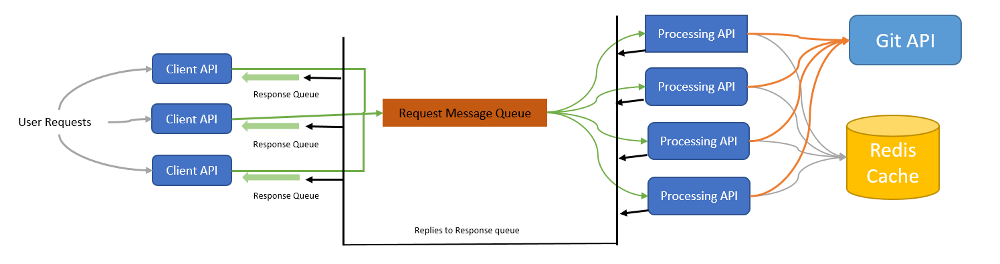

# Fetch Users using GIT API

## Introduction

This project builds an API to fetch user details from Github.

## Architecture



We use message queues to ensure that request are not lost during suddent peaks.

If the same user are details are requested frequently we cache them in-memory.

## Installation

Redis, RabbitMQ, Node.js should be installed.

Run UI_RouteProxy and DataFetcher using the below command.

```bash
node app.js
```